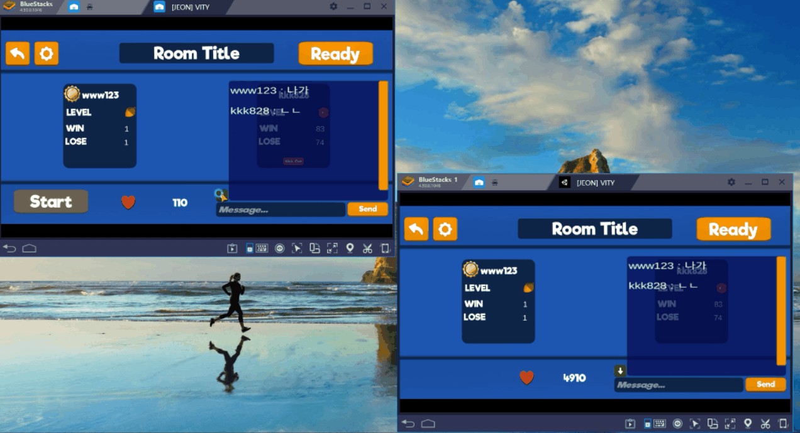

# Vity - 멀티플레이 술래잡기 모바일 게임  

[제작기간] 12주     
[프로젝트 내용] 유니티로 제작한 멀티플레이 술래잡기 모바일 게임  
[프로젝트 인원] 1명    

시연영상 : <http://115.68.221.104/vity.html>    
블로그 : <https://jroomstudio.tistory.com/>    
Email : <jhhh171224@gmail.com>    
* * *
### SKILL
  > #### Front-end   
  >  * Unity(C#)
  > #### Back-end
  >  * MySQL
  >  * AWS - Ubuntu
  >  * java 
  >  * json 데이터 
  >  * HTTP, TCP, UDP 통신 
  >  * PHP
  >  * Agora Gaming SDK (음성채팅)
* * *
### 세부 기능 
  > ### 회원가입 
  > </img>
  > * Firebase Authentication 을 활용한 회원가입과 로그인 구현 
  > * 앱 처음 실행할 때, 로그인할 때 각각 로딩화면 구현 
  > * * *
  > ### 로그인
  > </img>
  > * Firebase Authentication 을 활용한 회원가입과 로그인 구현 
  > * 앱 처음 실행할 때, 로그인할 때 각각 로딩화면 구현 
  > * * *
  > ### 방만들기 
  > </img>
  > * Firebase Authentication 을 활용한 회원가입과 로그인 구현 
  > * 앱 처음 실행할 때, 로그인할 때 각각 로딩화면 구현 
  > * * *
  > ### 로비 채팅
  > </img>
  > * Firebase Authentication 을 활용한 회원가입과 로그인 구현 
  > * 앱 처음 실행할 때, 로그인할 때 각각 로딩화면 구현 
  > * * *
  > ### 게임방 채팅 
  > </img>
  > * Firebase Authentication 을 활용한 회원가입과 로그인 구현 
  > * 앱 처음 실행할 때, 로그인할 때 각각 로딩화면 구현 
  > * * *
  > ### 방장 변경 
  > </img>
  > * Firebase Authentication 을 활용한 회원가입과 로그인 구현 
  > * 앱 처음 실행할 때, 로그인할 때 각각 로딩화면 구현 
  > * * *
  > ### 강퇴
  > </img>
  > * Firebase Authentication 을 활용한 회원가입과 로그인 구현 
  > * 앱 처음 실행할 때, 로그인할 때 각각 로딩화면 구현 
  > * * *
  > ### 조이스틱
  > </img>
  > * Firebase Authentication 을 활용한 회원가입과 로그인 구현 
  > * 앱 처음 실행할 때, 로그인할 때 각각 로딩화면 구현 
  > * * *
  > ### 캐릭터 셋팅
  > </img>
  > * Firebase Authentication 을 활용한 회원가입과 로그인 구현 
  > * 앱 처음 실행할 때, 로그인할 때 각각 로딩화면 구현 
  > * * *
  > ### 1대1 대전 
  > </img>
  > * Firebase Authentication 을 활용한 회원가입과 로그인 구현 
  > * 앱 처음 실행할 때, 로그인할 때 각각 로딩화면 구현 
  > * * *
  > ### 4인 대전
  > </img>
  > * Firebase Authentication 을 활용한 회원가입과 로그인 구현 
  > * 앱 처음 실행할 때, 로그인할 때 각각 로딩화면 구현 
  > * * *
  > ### Multi room
  > </img>
  > * Firebase Authentication 을 활용한 회원가입과 로그인 구현 
  > * 앱 처음 실행할 때, 로그인할 때 각각 로딩화면 구현 
  > * * *
  > ### 음성채팅 
  > </img>
  > * Firebase Authentication 을 활용한 회원가입과 로그인 구현 
  > * 앱 처음 실행할 때, 로그인할 때 각각 로딩화면 구현 
  > * * *
